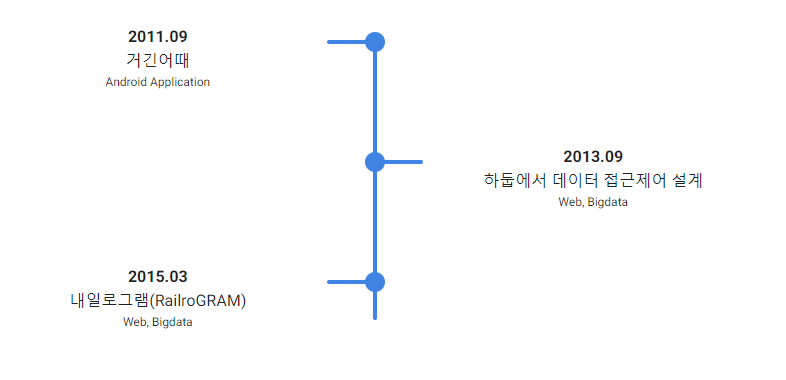

늘 기술을 온전히 내것으로 만들려는 노력을 6년째 진행중인 \
웹 개발자 `경력 6년` 개발자 `김희주` 입니다😉

# 👍 Speciallity

1. Java
2. SpringBoot
3. Kafka
4. Docker
5. MongoDB / MariaDB / Oracle / PostgreSQL
6. Ubuntu

# 👩🏻‍🏫 Description

---

## 👉🏻 내일로그램(RailroGRAM)

* `개발 기간`
  - 2015.03 - 2015.05
  
* `개발 환경`
  - Windows 7, Ubuntu
  
* `사용 기술`
    - Java, JDK 1.7, Tomcat 8 / Oracle, Cassandra

* `프로젝트 소개`
    - 코레일의 내일로 프로젝트가 시작한 이래로 매년 다수의 청춘남녀들이 이 프로그램에 참여하고 있습니다. 하지만 현재 네이버 카페, 다음 카페, 각종 블로그로 분산 저장되어있는 내일로 관련 정보들은 각 포털 사이트의 형태에 맞추어져 제공되고 있습니다. 본 프로젝트는 모든 정보를 통합하는 웹 페이지를 제공하기 위하여 만들어졌으며, 보다 편리한 데이터 검색과 사용을 위하여 소셜 페이지인 인스타그램의 ‘태그(TAG)’ 기능 기반으로 만들었습니다. 실시간성을 보장하고 (사용자와 데이터가 많아진다는 전제 하에)빅데이터의 처리를 위하여 아파치 서브 프로젝트인 카산드라(Cassandra)를 사용하였습니다. 이 뿐 아니라 여행이라는 매개로 만나 많은 이야기를 하고 공감대 형성을 한다는 점을 착안하여 게시판과 정보 제공 페이지 등을 만들어 여행을 좀 더 즐겁게 보내는 컨텐츠로 구성하였습니다. 또한 R을 활용한 데이터 마이닝을 통해 사용자가 검색한 데이터 기반의 추천시스템을 제공하였습니다. 
    
* `본 프로젝트에서 담당한 역할`
    - 본 프로젝트에서는 전체총괄과 함께 R을 활용해 빅데이터를 분석해내는 데이터 마이닝을 담당하였습니다. 가장 먼저 카산드라에 저장된 대용량의 데이터와 R을 연동하였습니다. 하지만 R의 CLI(Commend Line Interface)와 CQL(Cassandra Query Language)의 데이터 구조 불일치로 어려움을 겪었습니다. 하지만 이에 그치지 않고 JDBC와의 3중 연동을 통하여 결과 데이터를 얻어낼 수 있었습니다. 기본 알고리즘은 추천 시스템에서 가장 많이 사용하는 연관 규칙(Apriori) 알고리즘을 사용하였으며, 알고리즘을 통해 나온 규칙 데이터(rule-data)를 태그형태로 카산드라에 다시 저장하는 형태로 진행하였습니다.

---

## 👉🏻 하둡에서 데이터 접근 제어 설계

* `개발 기간`
  - 2013.09 - 2014.09

* `개발 환경`
  - Windows 7, Cent OS, Eclipse

* `사용 기술`
  - Java, XML, JDK 1.7, Hadoop / HBase

* `프로젝트 소개`
  - 하둡은 빅데이터를 지금 현재 가장 효과적으로 처리할 수 있는 툴이라고 알려져 있습니다. 하지만 하둡 내부에서의 접근 제어를 위해 소스를 분석한 결과, 데이터에 데이터를 가지고 있는 소유자(Data-owner)와 데이터 사용자(Data-user)의 분리가 되지 않는다는 사실을 발견하였고, 접근제어 기술이 필요하다는 문제를 제기하였습니다.

* `본 프로젝트에서 담당한 역할`
  - 본 프로젝트는 ETRI와의 산학협력과제로 진행되었으며, 팀장인 교수님을 중심으로 팀원으로서 전체 프레임워크를 설계하고 개발하였습니다. 특히, 사용자와 사용자별 기능을 구별할 수 있는 메타데이터 설계를 중심적으로 하였으며 이를 XML 형태/HBASE의 DB 스키마 형태로 나누어 개발해냈습니다. 이 메타데이터를 실제 접근 관리해내기 위하여 Hadoop 내부의 소스 중 사용자의 정보가 있는 코드 부분을 분석했으며, 접근 관리 모듈 에서 실제로 메타데이터를 통한 접근제어가 됨을 확인할 수 있었습니다.

---

## 👉🏻 거긴어때?

* `개발 기간`
  - 2011.09 - 2011.10

* `개발 환경`
  - Windows 7, Eclipse

* `사용 기술`
  - Android for java, XML, JDK 1.6 / SQLite

* `프로젝트 소개`
  - GPS기반의 실시간 위치 정보가 필요한 사람들을 도와줄 수 있는 어플리케이션으로, Java 기반의 서버/클라이언트 구조를 가집니다. 기본적인 구조는 다음과 같습니다. 1) 정보가 보호된다는 전제하에 클라이언트들은 각각의 위치정보를 공개합니다. 2) 클라이언트가 특정 위치에 있는 다른 클라이언트에게 실시간으로 사진/동영상 요청을 합니다. 3) 서버를 통해 요청 메시지가 넘어가고, 다른 클라이언트가 요청에 동의를 한다면 실시간으로 사진/동영상을 보냅니다. 이러한 기본 구조를 바탕으로 사용자들의 신뢰도를 높이기 위하여 게임머니안을 제안하였으며, 클라이언트 간 게임머니를 주고 받음을 통해 데이터의 정확성을 높이며 동시에 수익을 창출할 수 있음을 기대한 프로젝트였습니다.

* `본 프로젝트에서 담당한 역할`
  - 본 프로젝트는 서버 담당자, 클라이언트 담당자 두 사람으로 구성되어 진행하였으며, 본인은 전체 프로그램 기획을 담당함과 동시에 클라이언트를 담당하여 작업하였습니다. Google에서 제공해주는 GPS API를 사용하여 각 클라이언트 정보를 저장하고 화면에 뿌려주는 부분을 구현하였으며 사용자, 사진/동영상, 메시지 등의 데이터를 서버로 보내주는 부분을 구현하였습니다. 기획 자체가 신선하고 기존의 다른 어플리케이션과 차별화 되어있어 본교의 창의작품 경진대회에서 상을 받은 어플리케이션이었습니다.

---

### 📞 Contact me

[lovehopy1@gmail.com](mailto:lovehopy1@gmail.com)
